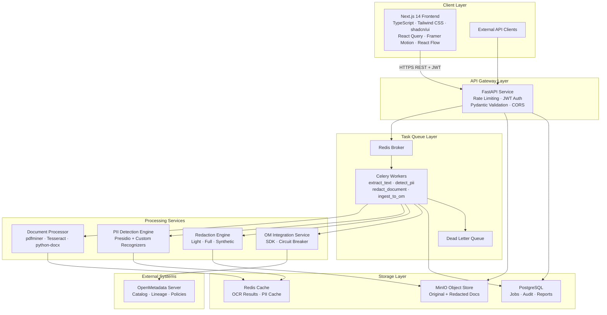
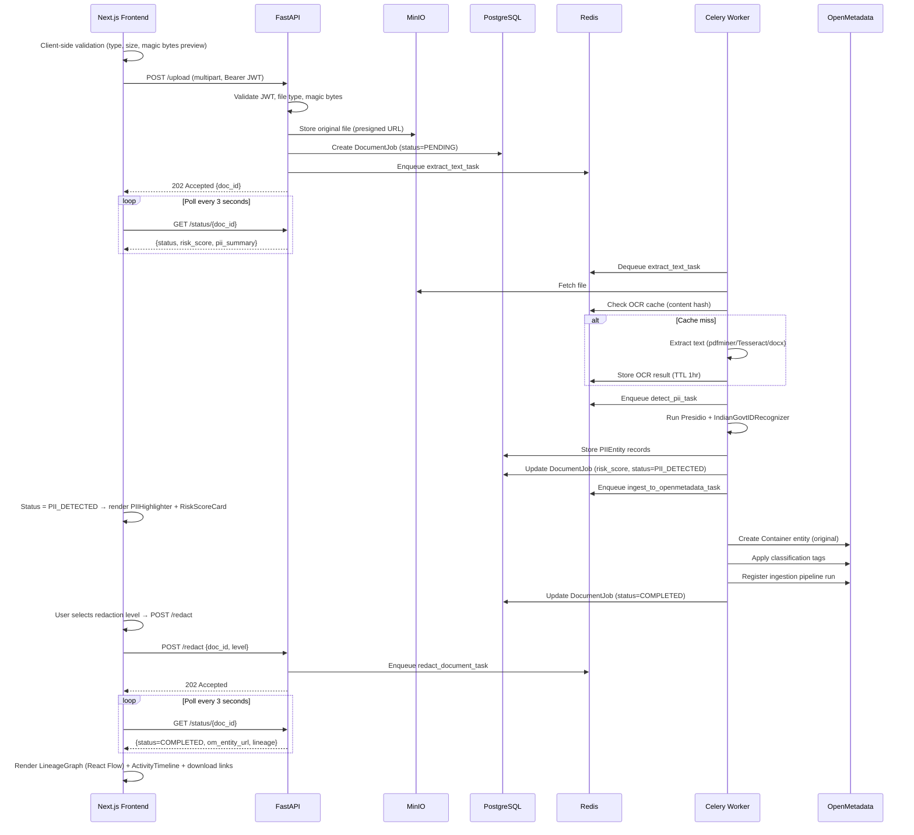
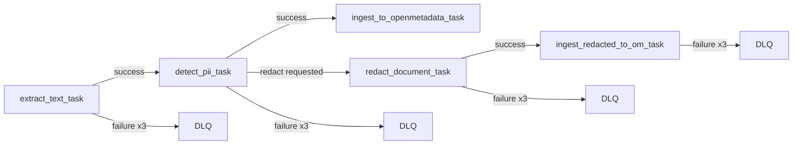
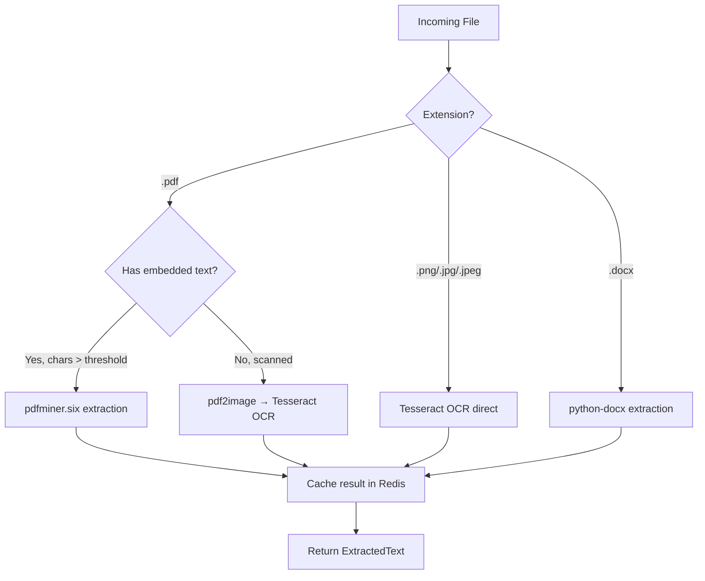
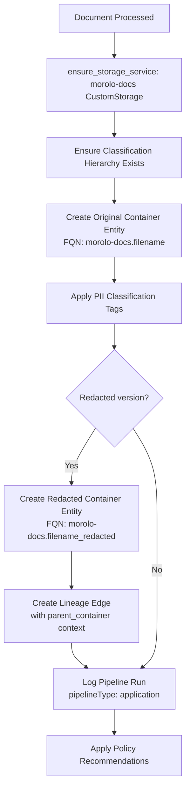

# Design Document: Morolo

## Overview

Morolo is a production-grade document-level PII detection, redaction, and governance system. It extends OpenMetadata to handle unstructured documents — PDFs (text-based and scanned), images, and Word files — with a focus on Indian government-issued identifiers (Aadhaar, PAN, Driving License) required for DPDP Act compliance.

The system is designed around Google-scale engineering principles: horizontal scalability via stateless workers, fault tolerance through retry/circuit-breaker patterns, strong security via JWT + presigned URLs, and clean separation of concerns across well-defined service boundaries.

### Key Design Goals

- **Async API layer, synchronous workers**: FastAPI endpoints are fully async (`async def`) — no blocking I/O in the request path. Celery workers are synchronous by design; OCR (pytesseract subprocess), pdfminer, and python-docx are all blocking operations. This is architecturally correct: the API layer is non-blocking, and heavy CPU/IO work is offloaded to worker processes. Do not use `asyncpg` or `async def` inside Celery tasks without explicitly running an event loop.
- **Idempotent processing**: Documents are keyed by content hash. Re-uploading the same file reuses cached OCR and PII results.
- **Governance-native**: OpenMetadata is not an afterthought — Container entities (under a registered `morolo-docs` CustomStorage service), lineage edges, classification tags, and application pipeline run records are first-class outputs of every processing run.
- **Auditability**: Every action (upload, detect, redact, ingest) is recorded in an immutable audit log with actor, timestamp, and structured details.
- **Graceful degradation**: If OpenMetadata is unavailable, document processing completes and OM tasks are queued for later replay.

---

## Architecture

### High-Level Component Diagram



### Request Flow: Document Upload → Governance



### Celery Task Chain



---

## Components and Interfaces

### 1. API Gateway (FastAPI)

**Responsibilities**: Authentication, rate limiting, request validation, file ingestion, response formatting.

**Endpoints**:

| Method | Path | Description |
|--------|------|-------------|
| POST | `/upload` | Upload document, returns `doc_id` |
| POST | `/redact` | Trigger redaction for a processed document |
| GET | `/status/{doc_id}` | Poll processing status and results |
| GET | `/risk-score/{doc_id}` | Get risk score and PII summary |
| GET | `/audit/{doc_id}` | Get chronological audit log for a document |
| GET | `/health` | Health check with dependency status |

**Key Design Decisions**:
- All endpoints are `async def` — no blocking I/O in the request path.
- File uploads use `UploadFile` with chunked streaming to avoid loading entire files into memory.
- Rate limiting via `slowapi` (token bucket, per-IP): 10 uploads/min, 100 status checks/min.
- Magic byte validation runs before any processing — rejects files that lie about their extension.
- `POST /upload` returns `202 Accepted` immediately; processing is async via Celery.

**File Validation Logic**:
```python
ALLOWED_MAGIC_BYTES = {
    "pdf":  b"%PDF",
    "png":  b"\x89PNG",
    "jpg":  b"\xff\xd8\xff",
    "jpeg": b"\xff\xd8\xff",
    "docx": b"PK\x03\x04",  # ZIP-based format
}
MAX_FILE_SIZES = {"pdf": 10_485_760, "docx": 10_485_760, "png": 5_242_880, "jpg": 5_242_880, "jpeg": 5_242_880}
```

### 2. Document Processor

**Responsibilities**: Text extraction from all supported formats, scanned PDF detection, OCR result caching.

**Extraction Strategy**:



**Scanned PDF Detection**: A PDF is considered scanned if the ratio of extractable characters to total pages is below a configurable threshold (default: 50 chars/page). This handles mixed PDFs (some text pages, some scanned) by processing each page independently.

**Cache Key**: `sha256(file_bytes)` — content-addressed, so identical files never re-process.

**Interface**:
```python
class DocumentProcessor:
    async def extract_text(self, file_bytes: bytes, filename: str) -> ExtractedText
    async def detect_scan_type(self, pdf_bytes: bytes) -> ScanType  # TEXT | SCANNED | MIXED
```

### 3. PII Detection Engine

**Responsibilities**: Run Presidio with built-in and custom Indian ID recognizers, calculate risk scores, filter by confidence threshold.

**Recognizer Strategy — Reuse Built-ins, Extend for DL**:

Presidio ships built-in recognizers `IN_AADHAAR` and `IN_PAN`. Rather than reimplementing these from scratch (which risks duplicate entity detection and score conflicts), Morolo wraps them:

- **Aadhaar**: Use Presidio's `InAadhaarRecognizer` (supports plain `xxxxxxxxxxxx`, space-delimited `xxxx xxxx xxxx`, and hyphen-delimited `xxxx-xxxx-xxxx` formats). Create a thin `AadhaarAliasRecognizer` wrapper that renames the entity type from `IN_AADHAAR` → `AADHAAR` and attaches `subtype = "IndianGovtID"`.
- **PAN**: Use Presidio's `InPanRecognizer`. Create a thin `PANAliasRecognizer` wrapper that renames `IN_PAN` → `PAN` and attaches `subtype = "IndianGovtID"`.
- **Driving License**: No built-in recognizer exists. Implement `DrivingLicenseRecognizer` as a custom `PatternRecognizer` subclass with a tightened regex and context words to reduce false positives.

**Custom Recognizer — DrivingLicenseRecognizer**:

| ID Type | Pattern | Context Words | Example |
|---------|---------|---------------|---------|
| Driving License | `\b[A-Z]{2}[0-9]{2}\s?[A-Z]{1,2}\s?[0-9]{4}\s?[0-9]{7}\b` | `["DL", "driving licence", "driving license", "license no", "licence no", "dl no"]` | `MH12 AB 2023 1234567` |

The context words boost confidence when the pattern appears near a DL label, reducing false positives from alphanumeric product codes and invoice references that match the bare regex.

**Why not reimplement Aadhaar/PAN**: The original design's Aadhaar pattern `\b[2-9]\d{3}\s?\d{4}\s?\d{4}\b` only allows a single optional space as delimiter. Real documents also use hyphens (`2345-6789-0123`) and colons. Presidio's updated `InAadhaarRecognizer` handles all three delimiters. Using the narrow custom pattern would produce false negatives on real-world scanned documents.

**Risk Scoring Algorithm**:

The formula aggregates by entity type, not by individual instance. `count` is the number of distinct instances of each type detected in the document.

```
risk_score = min(100, Σ_per_type (entity_weight[type] × avg_confidence[type] × count_factor[type]))

count_factor[type] = log(1 + count[type]) / log(2)  # diminishing returns per type

entity_weights = {
    "AADHAAR":          10.0,
    "PAN":              9.0,
    "DRIVING_LICENSE":  8.0,
    "PHONE_NUMBER":     5.0,
    "EMAIL_ADDRESS":    4.0,
    "PERSON":           3.0,
}
```

**Aggregation is per-type**: If a document has 3 Aadhaar numbers, `count["AADHAAR"] = 3`, `count_factor = log(4)/log(2) = 2.0`. Adding a 4th Aadhaar increases the score by `10.0 × confidence × (log(5)/log(2) - log(4)/log(2)) ≈ 3.2`, which is always positive. Property 3 (monotonicity) holds because adding any entity of any type always increases or maintains the score — the `log` count factor is strictly monotonically increasing.

Risk bands: 0–25 = LOW, 26–50 = MEDIUM, 51–75 = HIGH, 76–100 = CRITICAL.

**Interface**:
```python
class PIIDetector:
    async def detect(self, text: str, language: str = "en") -> PIIDetectionResult
    def calculate_risk_score(self, entities: list[PIIEntity]) -> float
    # Internal: aggregates entities by type before scoring
    def _aggregate_by_type(self, entities: list[PIIEntity]) -> dict[str, list[PIIEntity]]
```

### 4. Redaction Engine

**Responsibilities**: Apply redaction transformations at three levels, generate redaction reports, maintain audit mappings.

**Redaction Levels**:

| Level | Behavior | Example Input | Example Output |
|-------|----------|---------------|----------------|
| LIGHT | Preserve first 2 + last 2 chars, mask middle | `ABCDE1234F` | `AB*****4F` |
| FULL | Replace entirely | `ABCDE1234F` | `[REDACTED]` |
| SYNTHETIC | Format-preserving fake data | `ABCDE1234F` | `XYZPQ5678G` |

**Synthetic Generation**: Uses `faker` with custom providers for Indian IDs. The generated value matches the original format (same length, same character class distribution) but is cryptographically random and not a real ID.

**Audit Mapping**: Every redaction stores `{original_value_hash: redacted_value}` — the original value is hashed (SHA-256) before storage so the audit log never contains plaintext PII.

**Interface**:
```python
class RedactionEngine:
    async def redact(self, text: str, entities: list[PIIEntity], level: RedactionLevel) -> RedactionResult
    def generate_report(self, job_id: UUID, result: RedactionResult) -> RedactionReport
```

### 5. OpenMetadata Integration Service

**Responsibilities**: Register parent StorageService, create Container entities, apply classification tags, create lineage edges, register application pipeline run, apply policies.

**Critical Prerequisite — StorageService Registration**: OpenMetadata Container entities cannot exist without a parent StorageService. On startup, `OMIntegrationService` calls `ensure_storage_service()` which creates (or verifies) a `CustomStorage` service named `morolo-docs`. All Container FQNs are then `morolo-docs.{filename}`. This is idempotent — if the service already exists, the call is a no-op.

```python
# StorageService registration (runs once on startup)
from metadata.generated.schema.api.services.createStorageService import CreateStorageServiceRequest
from metadata.generated.schema.entity.services.storageService import StorageServiceType

create_storage_service_request = CreateStorageServiceRequest(
    name="morolo-docs",
    serviceType=StorageServiceType.CustomStorage,
    description="Morolo document governance storage service",
)
metadata.create_or_update(create_storage_service_request)
# All Container FQNs: morolo-docs.{filename}
```

**Pipeline Registration — pipelineType "application"**: The `pipelineType` enum in OpenMetadata is strictly constrained. There is no `custom` type. Morolo registers itself using `pipelineType: "application"` — the correct slot for bespoke ingestion tooling. Run history and status logging via `pipelineStatus` records (`queued`, `running`, `success`, `failed`, `partialSuccess`) work correctly with this type. Manual UI triggering requires calling the OM API directly; Airflow is not a dependency.

**Container Entity — fileFormats, not dataModel**: The `dataModel` field on Container describes tabular schema (column names, data types) and is designed for structured data. For unstructured documents (PDFs, images, DOCX), `dataModel` is left `null`. Document type is conveyed via the `fileFormats` field (e.g., `["pdf"]`) and custom extension properties (`riskScore`, `detectedPIITypes`).

**Lineage — parent_container required**: A known issue in OpenMetadata's Container lineage resolution requires the parent container context to be passed explicitly in lineage edge nodes. The `build_lineage_edge()` method includes the parent service reference in both `fromEntity` and `toEntity` node objects rather than relying on FQN resolution alone. If lineage creation fails with `TypeError: _() missing 1 required keyword-only argument: 'parent_container'`, the error is caught, logged, and the job continues — lineage failure does not block document processing.

**Circuit Breaker Configuration** (pybreaker):
- Failure threshold: 5 consecutive failures → OPEN state
- Recovery timeout: 60 seconds
- Half-open probe: 1 request to test recovery

**Entity Creation Flow**:


**Classification Hierarchy**:
```
PII
└── Sensitive
    └── IndianGovtID
        ├── Aadhaar
        ├── PAN
        └── DrivingLicense
```

**Co-existence with OM Auto-Classification**: OpenMetadata's built-in Auto Classification agent can also tag PII Sensitive data on ingested entities. To avoid duplicate or conflicting tags, Morolo checks for existing tags before applying its own. If OM's auto-classifier has already applied a `PII.Sensitive` tag, Morolo adds its more specific `IndianGovtID` subtags without removing the existing ones.

**SDK Version Requirement**: StorageService entity support was added to the OpenMetadata Python SDK in a recent release. The `requirements.txt` must pin `openmetadata-ingestion` to a version that includes `CreateStorageServiceRequest` and `StorageServiceType.CustomStorage`. The minimum required version must be verified against the target OM server version and documented in the README.

**Interface**:
```python
class OMIntegrationService:
    async def ensure_storage_service(self) -> str                    # returns service FQN, idempotent
    async def ensure_classification_hierarchy(self) -> None          # idempotent
    async def build_container_entity(self, job: DocumentJob, is_redacted: bool) -> CreateContainerRequest
    async def create_container_entity(self, job: DocumentJob, is_redacted: bool) -> str  # returns FQN
    async def apply_tags(self, entity_fqn: str, pii_types: list[str]) -> None
    async def build_lineage_edge(self, original_fqn: str, redacted_fqn: str, metadata: dict) -> AddLineageRequest
    async def create_lineage_edge(self, original_fqn: str, redacted_fqn: str, metadata: dict) -> str | None
    async def register_pipeline_run(self, job: DocumentJob, status: PipelineStatus) -> None
    async def apply_policy(self, entity_fqn: str, policy_id: str) -> None
```

### 6. Redaction Metadata Parser and Pretty Printer

**Responsibilities**: Serialize/deserialize `RedactionMetadata` to/from JSON with full round-trip fidelity.

**Design Rationale**: Pydantic v2 models are used as the canonical schema. The parser uses `RedactionMetadata.model_validate_json()`. The pretty printer uses `json.dumps(metadata.model_dump(mode="json"), indent=2, sort_keys=True)` — **not** `model_dump_json(sort_keys=True)`, which does not exist in Pydantic v2 and raises `TypeError` at runtime. Using `model_dump(mode="json")` first converts all types (UUID, datetime, Enum) to JSON-serializable primitives, then `json.dumps` applies deterministic indentation and key sorting. This guarantees the round-trip property (`parse(pretty_print(x)) == x`) because Pydantic's deserialization validates against the same schema that produced the serialized output.

**Interface**:
```python
import json

class RedactionMetadataParser:
    @staticmethod
    def parse(json_str: str) -> RedactionMetadata:
        # raises pydantic.ValidationError with descriptive message on invalid input
        return RedactionMetadata.model_validate_json(json_str)

class RedactionMetadataPrettyPrinter:
    @staticmethod
    def pretty_print(metadata: RedactionMetadata) -> str:
        # model_dump(mode="json") converts UUID/datetime/Enum to JSON-serializable types
        # json.dumps applies 2-space indent and sorted keys — sort_keys not available on model_dump_json
        return json.dumps(metadata.model_dump(mode="json"), indent=2, sort_keys=True)
```

---

## Frontend Architecture (Next.js 14)

### Overview

The Morolo frontend is a stateless, API-driven React SPA built on Next.js 14 App Router. It communicates exclusively with the FastAPI backend over HTTPS using JWT bearer tokens. No business logic, secrets, or processing state lives in the frontend — it is a pure presentation and interaction layer.

**Technology Stack:**

| Concern | Library |
|---------|---------|
| Framework | Next.js 14 (App Router, RSC where applicable) |
| Language | TypeScript (strict mode) |
| Styling | Tailwind CSS + shadcn/ui component library |
| Data fetching | React Query (TanStack Query v5) |
| Animations | Framer Motion |
| Graph visualization | React Flow |
| HTTP client | Axios (with interceptors for JWT injection) |
| State (lightweight) | Zustand (upload session state only) |
| Notifications | sonner (toast library) |
| Icons | lucide-react |

### Project Structure

```
frontend/
├── app/
│   ├── layout.tsx              # Root layout: providers, fonts, global styles
│   ├── page.tsx                # Landing page (marketing + entry CTA)
│   ├── dashboard/
│   │   ├── page.tsx            # Dashboard shell
│   │   └── [docId]/
│   │       └── page.tsx        # Document detail view (dynamic route)
│   └── api/                    # Next.js route handlers (proxy if needed)
├── components/
│   ├── upload/
│   │   └── UploadDropzone.tsx
│   ├── document/
│   │   ├── DocumentViewer.tsx
│   │   └── PIIHighlighter.tsx
│   ├── risk/
│   │   └── RiskScoreCard.tsx
│   ├── redaction/
│   │   └── RedactionControls.tsx
│   ├── lineage/
│   │   └── LineageGraph.tsx
│   ├── activity/
│   │   └── ActivityTimeline.tsx
│   └── shared/
│       └── StatusIndicator.tsx
├── lib/
│   ├── api.ts                  # Axios instance + typed API functions
│   ├── queries.ts              # React Query query/mutation definitions
│   └── store.ts                # Zustand store
├── types/
│   └── api.ts                  # TypeScript types mirroring backend Pydantic schemas
├── hooks/
│   ├── useDocumentStatus.ts    # Polling hook
│   └── useUpload.ts            # Upload mutation hook
└── Dockerfile
```

### Page Architecture

#### Landing Page (`/`)

Marketing entry point. Communicates Morolo's value proposition with a hero section, feature highlights, and a prominent "Start Analyzing" CTA that routes to `/dashboard`. Rendered as a Next.js Server Component — no client-side data fetching required.

#### Dashboard (`/dashboard`)

The core application shell. Renders the `UploadDropzone` by default. Once a document is uploaded, the URL transitions to `/dashboard/{docId}` and the full analysis UI renders.

#### Document Detail (`/dashboard/[docId]`)

Dynamic route that loads document state via React Query. Renders all analysis components in a responsive grid layout:

```
┌─────────────────────────────────────────────────────┐
│  StatusIndicator (pipeline progress bar)            │
├──────────────────────┬──────────────────────────────┤
│  DocumentViewer      │  RiskScoreCard               │
│  + PIIHighlighter    │  RedactionControls           │
│                      │  ActivityTimeline            │
├──────────────────────┴──────────────────────────────┤
│  LineageGraph (React Flow, full width)              │
└─────────────────────────────────────────────────────┘
```

### Component Specifications

#### `UploadDropzone`

**Responsibility**: Accept file input via drag-and-drop or click, perform client-side validation, and trigger the upload mutation.

**Behavior**:
- Accepts `.pdf`, `.png`, `.jpg`, `.jpeg`, `.docx`
- Client-side validation: extension whitelist + file size limits (PDF/DOCX ≤ 10MB, images ≤ 5MB)
- Reads first 4 bytes of file to verify magic bytes before upload (defense-in-depth)
- On valid file: calls `POST /upload` via `useUpload` hook, navigates to `/dashboard/{docId}`
- On invalid file: displays inline error with `sonner` toast, does not submit
- Animated drop target using Framer Motion (scale + border color transition on drag-over)

```typescript
interface UploadDropzoneProps {
  onUploadSuccess: (docId: string) => void;
}
```

#### `DocumentViewer` + `PIIHighlighter`

**Responsibility**: Render the extracted document text with PII spans visually highlighted by entity type.

**Behavior**:
- Receives `extractedText: string` and `piiEntities: PIIEntity[]` (with `start_offset`, `end_offset`, `entity_type`)
- Splits text into segments: plain text and PII spans
- Renders PII spans as `<mark>` elements with Tailwind color classes per entity type:

| Entity Type | Color |
|-------------|-------|
| AADHAAR | `bg-red-200 text-red-900` |
| PAN | `bg-orange-200 text-orange-900` |
| DRIVING_LICENSE | `bg-yellow-200 text-yellow-900` |
| EMAIL_ADDRESS | `bg-blue-200 text-blue-900` |
| PHONE_NUMBER | `bg-purple-200 text-purple-900` |
| PERSON | `bg-green-200 text-green-900` |

- Tooltip on hover shows entity type, confidence score, and subtype
- Skeleton loader shown while `status < PII_DETECTED`

```typescript
interface PIIHighlighterProps {
  text: string;
  entities: PIIEntity[];
}
```

#### `RiskScoreCard`

**Responsibility**: Display the numeric risk score and risk band with a visual severity indicator.

**Behavior**:
- Renders a shadcn/ui `Card` with a large numeric score (0–100)
- Color-coded badge for risk band: LOW (green), MEDIUM (yellow), HIGH (orange), CRITICAL (red)
- Animated score counter using Framer Motion `useMotionValue` + `useSpring` on mount
- PII type breakdown as a mini bar chart (shadcn/ui `Progress` components)
- Skeleton loader while data is loading

```typescript
interface RiskScoreCardProps {
  riskScore: number;
  riskBand: 'LOW' | 'MEDIUM' | 'HIGH' | 'CRITICAL';
  piiSummary: Record<string, number>;
}
```

#### `RedactionControls`

**Responsibility**: Allow the user to select a redaction level and trigger the redaction pipeline.

**Behavior**:
- shadcn/ui `RadioGroup` with three options: Light, Full, Synthetic
- "Apply Redaction" button: calls `POST /redact`, disabled while `status` is `PENDING`, `EXTRACTING`, or `REDACTING`
- On success: `sonner` toast "Redaction queued — processing…"
- On completion: download buttons for redacted document (presigned MinIO URL) and redaction report JSON
- Framer Motion `AnimatePresence` for smooth show/hide of download section

```typescript
interface RedactionControlsProps {
  docId: string;
  status: JobStatus;
  redactedFileUrl: string | null;
  reportUrl: string | null;
}
```

#### `LineageGraph`

**Responsibility**: Render the OpenMetadata lineage as an interactive directed graph.

**Behavior**:
- Uses React Flow with two node types: `OriginalDocNode` and `RedactedDocNode`
- Edge label shows redaction level and timestamp
- Nodes display: filename, risk band badge, OM entity FQN, link to OM UI
- Animated edge using React Flow `AnimatedSVGEdge`
- Zoom/pan controls enabled; minimap shown for large graphs
- Skeleton placeholder shown until `om_original_fqn` is populated

```typescript
interface LineageGraphProps {
  originalFqn: string;
  redactedFqn: string | null;
  redactionLevel: RedactionLevel | null;
  omBaseUrl: string;
}
```

#### `ActivityTimeline`

**Responsibility**: Display a chronological SOC-style audit log of all pipeline events.

**Behavior**:
- Fetches from `GET /audit/{doc_id}` (new endpoint, returns `AuditLog[]` for a document)
- Renders as a vertical timeline with icon per `AuditAction` type
- Each entry shows: action name, actor, timestamp (relative + absolute on hover), structured details
- Auto-refreshes via React Query `refetchInterval` while status is non-terminal
- Framer Motion `staggerChildren` animation on initial render

```typescript
interface ActivityTimelineProps {
  docId: string;
  isPolling: boolean;
}
```

#### `StatusIndicator`

**Responsibility**: Show the current pipeline stage as a progress stepper.

**Behavior**:
- Five steps: Upload → Extract → Detect → Redact → Complete
- Active step pulses with Framer Motion; completed steps show checkmark
- Failed state shows red X with error message tooltip
- Maps `JobStatus` enum values to step indices

```typescript
interface StatusIndicatorProps {
  status: JobStatus;
  errorMessage?: string;
}
```

### Frontend–Backend Interaction

#### API Client (`lib/api.ts`)

```typescript
const apiClient = axios.create({
  baseURL: process.env.NEXT_PUBLIC_API_URL,
  timeout: 30_000,
});

// Inject JWT from localStorage on every request
apiClient.interceptors.request.use((config) => {
  const token = localStorage.getItem('morolo_token');
  if (token) config.headers.Authorization = `Bearer ${token}`;
  return config;
});

// Typed API functions
export const uploadDocument = (file: File): Promise<UploadResponse> =>
  apiClient.post('/upload', formData(file)).then(r => r.data);

export const getDocumentStatus = (docId: string): Promise<StatusResponse> =>
  apiClient.get(`/status/${docId}`).then(r => r.data);

export const getRiskScore = (docId: string): Promise<RiskScoreResponse> =>
  apiClient.get(`/risk-score/${docId}`).then(r => r.data);

export const triggerRedaction = (req: RedactRequest): Promise<void> =>
  apiClient.post('/redact', req).then(r => r.data);

export const getAuditLog = (docId: string): Promise<AuditLog[]> =>
  apiClient.get(`/audit/${docId}`).then(r => r.data);
```

#### React Query Definitions (`lib/queries.ts`)

```typescript
// Upload mutation
export const useUploadMutation = () =>
  useMutation({ mutationFn: uploadDocument });

// Status polling — active while status is non-terminal
export const useDocumentStatus = (docId: string) =>
  useQuery({
    queryKey: ['document', docId, 'status'],
    queryFn: () => getDocumentStatus(docId),
    refetchInterval: (data) =>
      data && TERMINAL_STATUSES.includes(data.status) ? false : 3_000,
    staleTime: 0,
  });

// Risk score — fetched once PII_DETECTED
export const useRiskScore = (docId: string, enabled: boolean) =>
  useQuery({
    queryKey: ['document', docId, 'risk'],
    queryFn: () => getRiskScore(docId),
    enabled,
    staleTime: 60_000,
  });

// Redaction mutation
export const useRedactMutation = () =>
  useMutation({
    mutationFn: triggerRedaction,
    onSuccess: (_, vars) => {
      queryClient.invalidateQueries({ queryKey: ['document', vars.doc_id] });
    },
  });

// Audit log — polls while processing
export const useAuditLog = (docId: string, isPolling: boolean) =>
  useQuery({
    queryKey: ['document', docId, 'audit'],
    queryFn: () => getAuditLog(docId),
    refetchInterval: isPolling ? 3_000 : false,
  });
```

#### State Transition Mapping

```
JobStatus.PENDING
  → StatusIndicator: step 1 active (Upload)
  → DocumentViewer: skeleton
  → RiskScoreCard: skeleton
  → RedactionControls: disabled

JobStatus.EXTRACTING
  → StatusIndicator: step 2 active (Extract)
  → DocumentViewer: skeleton with "Extracting text…" label

JobStatus.PII_DETECTED
  → StatusIndicator: step 3 active (Detect)
  → DocumentViewer: renders PIIHighlighter with entity spans
  → RiskScoreCard: renders with score + band
  → RedactionControls: enabled

JobStatus.REDACTING
  → StatusIndicator: step 4 active (Redact)
  → RedactionControls: disabled, shows "Redacting…" spinner

JobStatus.COMPLETED
  → StatusIndicator: all steps complete
  → RedactionControls: shows download buttons
  → LineageGraph: renders with original + redacted nodes
  → ActivityTimeline: stops polling

JobStatus.FAILED
  → StatusIndicator: current step shows red X
  → Toast: error notification with message from API
```

### UX and Performance Design

**Skeleton Loaders**: Every data-dependent component renders a shadcn/ui `Skeleton` placeholder while its React Query query is in `loading` state. This prevents layout shift and communicates activity.

**Optimistic UI**: The `RedactionControls` component immediately disables and shows a spinner on button click before the `POST /redact` response arrives. The `useRedactMutation` `onMutate` callback sets local state optimistically.

**Error Boundaries**: Each major component section (`DocumentViewer`, `LineageGraph`, `ActivityTimeline`) is wrapped in a React `ErrorBoundary` that renders a shadcn/ui `Alert` with the error message and a retry button. This prevents a single component failure from crashing the entire page.

**Toast Notifications** (sonner):
- Upload success: "Document uploaded — analyzing…"
- PII detected: "Analysis complete — {N} PII entities found"
- Redaction queued: "Redaction queued — processing…"
- Redaction complete: "Redaction complete — files ready for download"
- Any API error: error toast with structured message from backend

**Polling Efficiency**: React Query's `refetchInterval` is set to `false` once a terminal status (`COMPLETED` or `FAILED`) is reached, stopping all polling automatically. The `staleTime: 0` on status queries ensures fresh data on every poll cycle.

**Code Splitting**: Each page-level component is dynamically imported with `next/dynamic`. The `LineageGraph` (React Flow) is the heaviest dependency and is loaded only when `om_original_fqn` is non-null.

### Security Considerations (Frontend)

- **No secrets in frontend**: API URL is the only environment variable exposed via `NEXT_PUBLIC_*`. JWT tokens are stored in `localStorage` (acceptable for SPA; `httpOnly` cookie upgrade path documented).
- **Client-side file validation**: Extension whitelist + magic byte check before upload. This is defense-in-depth — the backend performs authoritative validation.
- **No sensitive data in URLs**: `doc_id` (a UUID) is the only identifier in the URL. PII values, file contents, and tokens never appear in query parameters.
- **HTTPS assumed**: All API calls use the configured `NEXT_PUBLIC_API_URL`. The frontend enforces HTTPS in production via Next.js middleware redirect.
- **Content Security Policy**: Next.js `next.config.js` sets CSP headers restricting script sources to `'self'` and the configured API origin.
- **Error message sanitization**: Backend error messages are displayed as-is (they are structured and safe). Raw stack traces are never surfaced to the UI.

### Frontend Deployment

The Next.js app is containerized as a standalone build:

```dockerfile
FROM node:20-alpine AS builder
WORKDIR /app
COPY package*.json ./
RUN npm ci
COPY . .
RUN npm run build

FROM node:20-alpine AS runner
WORKDIR /app
ENV NODE_ENV=production
COPY --from=builder /app/.next/standalone ./
COPY --from=builder /app/.next/static ./.next/static
COPY --from=builder /app/public ./public
EXPOSE 3000
CMD ["node", "server.js"]
```

The `docker-compose.yml` service definition:

```yaml
frontend:
  build: ./frontend
  ports:
    - "3000:3000"
  environment:
    - NEXT_PUBLIC_API_URL=http://backend:8000
  depends_on:
    - backend
```

---

## Data Models

### SQLAlchemy Models (PostgreSQL)

```python
class DocumentJob(Base):
    __tablename__ = "document_jobs"
    
    id: UUID                          # Primary key
    filename: str                     # Original filename
    file_hash: str                    # SHA-256 of file content (unique index)
    file_size: int                    # Bytes
    mime_type: str                    # Detected MIME type
    status: JobStatus                 # PENDING | EXTRACTING | PII_DETECTED | REDACTING | COMPLETED | FAILED
    risk_score: float | None          # 0.0–100.0
    risk_band: RiskBand | None        # LOW | MEDIUM | HIGH | CRITICAL
    minio_original_key: str | None    # Object key in MinIO
    minio_redacted_key: str | None    # Object key in MinIO
    om_original_fqn: str | None       # OpenMetadata entity FQN
    om_redacted_fqn: str | None       # OpenMetadata entity FQN
    error_message: str | None         # Set on FAILED status
    created_at: datetime              # UTC
    updated_at: datetime              # UTC, auto-updated

class PIIEntity(Base):
    __tablename__ = "pii_entities"
    
    id: UUID
    job_id: UUID                      # FK → document_jobs.id
    entity_type: str                  # e.g. "AADHAAR", "EMAIL_ADDRESS"
    subtype: str | None               # e.g. "IndianGovtID"
    start_offset: int                 # Character offset in extracted text
    end_offset: int                   # Character offset in extracted text
    confidence: float                 # 0.0–1.0 from Presidio
    redacted_value: str | None        # Set after redaction
    original_value_hash: str | None   # SHA-256 of original, for audit

class RedactionReport(Base):
    __tablename__ = "redaction_reports"
    
    id: UUID
    job_id: UUID                      # FK → document_jobs.id
    redaction_level: RedactionLevel   # LIGHT | FULL | SYNTHETIC
    entities_redacted: int
    original_container_fqn: str | None
    redacted_container_fqn: str | None
    lineage_id: str | None            # OpenMetadata lineage edge ID
    report_json: dict                 # Full RedactionMetadata as JSONB
    created_at: datetime

class AuditLog(Base):
    __tablename__ = "audit_logs"
    
    id: UUID
    job_id: UUID | None               # FK → document_jobs.id (nullable for system events)
    action: AuditAction               # UPLOAD | EXTRACT | DETECT | REDACT | INGEST | POLICY_APPLY
    actor: str                        # JWT subject or "system"
    timestamp: datetime               # UTC
    details: dict                     # Structured JSONB details
    ip_address: str | None
```

### Pydantic Schemas (API + Serialization)

```python
class UploadResponse(BaseModel):
    doc_id: UUID
    status: JobStatus
    message: str

class StatusResponse(BaseModel):
    doc_id: UUID
    status: JobStatus
    risk_score: float | None
    risk_band: RiskBand | None
    pii_summary: dict[str, int]       # {"AADHAAR": 2, "EMAIL_ADDRESS": 5}
    om_entity_url: str | None
    created_at: datetime
    updated_at: datetime

class RedactRequest(BaseModel):
    doc_id: UUID
    redaction_level: RedactionLevel
    
class RiskScoreResponse(BaseModel):
    doc_id: UUID
    risk_score: float
    risk_band: RiskBand
    pii_entities: list[PIIEntitySchema]
    
class RedactionMetadata(BaseModel):
    """Canonical schema for parser/pretty-printer round-trip."""
    document_id: UUID
    filename: str
    redaction_level: RedactionLevel
    timestamp: datetime
    pii_instances: list[PIIInstanceRecord]
    total_entities_redacted: int
    risk_score_before: float
    risk_score_after: float           # Always 0.0 after full redaction

class PIIInstanceRecord(BaseModel):
    entity_type: str
    subtype: str | None
    start_offset: int
    end_offset: int
    confidence: float
    redaction_applied: str            # The redacted replacement value

class AuditLogResponse(BaseModel):
    """Returned by GET /audit/{doc_id} — consumed by ActivityTimeline."""
    id: UUID
    job_id: UUID
    action: AuditAction
    actor: str
    timestamp: datetime
    details: dict
    ip_address: str | None
```

### Enumerations

```python
class JobStatus(str, Enum):
    PENDING = "PENDING"
    EXTRACTING = "EXTRACTING"
    PII_DETECTED = "PII_DETECTED"
    REDACTING = "REDACTING"
    COMPLETED = "COMPLETED"
    FAILED = "FAILED"

class RedactionLevel(str, Enum):
    LIGHT = "LIGHT"
    FULL = "FULL"
    SYNTHETIC = "SYNTHETIC"
    NONE = "NONE"

class RiskBand(str, Enum):
    LOW = "LOW"
    MEDIUM = "MEDIUM"
    HIGH = "HIGH"
    CRITICAL = "CRITICAL"

class ScanType(str, Enum):
    TEXT = "TEXT"
    SCANNED = "SCANNED"
    MIXED = "MIXED"
```

---

## Correctness Properties

*A property is a characteristic or behavior that should hold true across all valid executions of a system — essentially, a formal statement about what the system should do. Properties serve as the bridge between human-readable specifications and machine-verifiable correctness guarantees.*

The following properties were derived by analyzing every acceptance criterion in the requirements document and classifying each as PROPERTY, EXAMPLE, INTEGRATION, EDGE_CASE, or SMOKE. Only criteria classified as PROPERTY appear here. Infrastructure wiring (OpenMetadata API calls, Tesseract OCR accuracy, pipeline registration) is covered by integration tests rather than property-based tests, since those test external service behavior rather than our code's logic.

---

### Property 1: Indian Government ID Detection Correctness

*For any* string containing a valid Indian government ID pattern (Aadhaar: 12-digit starting with 2–9; PAN: 5 uppercase letters + 4 digits + 1 uppercase letter; Driving License: state-code + digits), the PII detector SHALL return at least one entity with the correct `entity_type` and `subtype = "IndianGovtID"`.

**Validates: Requirements 2.1, 2.2, 2.3**

---

### Property 2: PII Entity Result Structure Completeness

*For any* text input that produces detected PII entities, every returned `PIIEntity` object SHALL have a non-null `entity_type`, a `start_offset` and `end_offset` that are valid character positions within the input text (`0 <= start < end <= len(text)`), and a `confidence` value in the range `[0.0, 1.0]`.

**Validates: Requirements 2.5**

---

### Property 3: Risk Score Monotonicity

*For any* two sets of PII entities A and B where B is a strict superset of A (same entities plus at least one additional entity of any type), the risk score computed for B SHALL be greater than or equal to the risk score computed for A. The formula aggregates by entity type — `count[type]` is the number of instances of each type. Adding any entity always increases `count_factor[type]` for that type (since `log` is strictly increasing), so the score is non-decreasing. The Hypothesis strategy for this property generates entity lists and additional entities using the same `_aggregate_by_type` logic to ensure consistent scoring.

**Validates: Requirements 2.6**

---

### Property 4: Light Redaction Format Preservation

*For any* PII entity value of length ≥ 5 characters, applying LIGHT redaction SHALL produce an output string of the same length where the first 2 characters and last 2 characters are identical to the original, and all middle characters are replaced with a masking character (e.g., `*`).

**Validates: Requirements 3.1**

---

### Property 5: Full Redaction Completeness — No PII in Output

*For any* text document and its associated list of detected PII entities, after applying FULL redaction, none of the original PII entity values (as identified by their character offsets) SHALL appear as a substring in the redacted output text.

**Validates: Requirements 3.2**

---

### Property 6: Synthetic Redaction Format Preservation

*For any* PII entity of a known type (Aadhaar, PAN, Driving License), applying SYNTHETIC redaction SHALL produce a replacement value that matches the same regex pattern as the original entity type — i.e., the synthetic value is a valid-format (but fake) instance of the same ID type.

**Validates: Requirements 3.3**

---

### Property 7: Redaction Output Always Produces File and Report

*For any* document text, list of PII entities, and redaction level (LIGHT, FULL, or SYNTHETIC), the `redact()` operation SHALL always return a `RedactionResult` containing both a non-empty redacted text output and a non-empty `RedactionReport` with at least one entry per redacted entity.

**Validates: Requirements 3.5**

---

### Property 8: Audit Mapping Completeness

*For any* set of N PII entities that are redacted in a single operation, the resulting audit mapping SHALL contain exactly N entries, where each entry is keyed by the SHA-256 hash of the original entity value and maps to the corresponding redacted replacement value.

**Validates: Requirements 3.6**

---

### Property 9: Container Entity Metadata Completeness

*For any* `DocumentJob` record with a non-null `filename`, `file_size`, `created_at`, and `risk_score`, the Container entity object constructed by `OM_Integration_Service.build_container_entity()` SHALL have non-null values for `name`, `size`, `uploadTimestamp`, `documentType`, and SHALL include custom extension properties for `riskScore` and `detectedPIITypes`.

**Validates: Requirements 4.3, 4.5**

---

### Property 10: Tag Selection Correctness

*For any* list of detected PII entity types, the tag selection function SHALL return the complete and correct set of OpenMetadata classification tags — specifically: Aadhaar detection maps to `PII.Sensitive.IndianGovtID.Aadhaar`, PAN maps to `PII.Sensitive.IndianGovtID.PAN`, Driving License maps to `PII.Sensitive.IndianGovtID.DrivingLicense`, and general PII types (email, phone) map to the corresponding standard OpenMetadata PII tags. No spurious tags SHALL be included.

**Validates: Requirements 5.2, 5.3, 5.4, 5.6**

---

### Property 11: Lineage Edge Metadata Completeness

*For any* lineage edge object constructed by `OM_Integration_Service.build_lineage_edge()`, the edge SHALL contain both a `redactionLevel` field (one of LIGHT, FULL, SYNTHETIC) and a `timestamp` field (a valid UTC datetime), in addition to the source and destination entity FQNs.

**Validates: Requirements 6.1, 6.2, 6.3**

---

### Property 12: Lineage Count Invariant

*For any* document that has been redacted K times at K distinct redaction levels, the total number of lineage edges created from the original Container entity SHALL be exactly K — one per redacted version, with no duplicates.

**Validates: Requirements 6.5**

---

### Property 13: Scan Type Detection Correctness

*For any* PDF where the average extractable character count per page is below the configured threshold (default: 50 chars/page), `detect_scan_type()` SHALL return `ScanType.SCANNED`. *For any* PDF where the average is above the threshold, it SHALL return `ScanType.TEXT`. Mixed PDFs (some pages above, some below) SHALL return `ScanType.MIXED`.

**Validates: Requirements 1.4**

---

### Property 14: Text Extraction Content Fidelity

*For any* text-based PDF or DOCX file containing a known set of text strings, the extracted text returned by `DocumentProcessor.extract_text()` SHALL contain all of those known strings as substrings (modulo whitespace normalization).

**Validates: Requirements 1.1, 1.3**

---

### Property 15: RedactionMetadata Round-Trip

*For any* valid `RedactionMetadata` object, serializing it to JSON using `RedactionMetadataPrettyPrinter.pretty_print()` and then parsing the result using `RedactionMetadataParser.parse()` SHALL produce an object that is equal to the original (field-by-field equality, including nested `PIIInstanceRecord` lists).

**Validates: Requirements 12.2, 12.5**

---

### Property 16: Pretty-Printer Output Format Consistency

*For any* `RedactionMetadata` object, the output of `RedactionMetadataPrettyPrinter.pretty_print()` SHALL be valid JSON (parseable without error), SHALL use exactly 2-space indentation, and SHALL have all object keys in lexicographically sorted order at every nesting level.

**Validates: Requirements 12.3, 12.6**

---

## Error Handling

### Error Categories and Responses

| Category | Trigger | HTTP Status | Behavior |
|----------|---------|-------------|----------|
| File validation failure | Wrong extension, magic byte mismatch, oversized file | 400 | Immediate rejection, structured error response |
| Unsupported format | File type not in whitelist | 415 | Structured error with supported formats list |
| Text extraction failure | Corrupt file, unreadable PDF | 422 | Job marked FAILED, error stored in `DocumentJob.error_message` |
| PII detection failure | Presidio internal error | 500 | Celery retry (max 3), then DLQ + FAILED status |
| OpenMetadata unavailable | Connection refused, timeout | — | Circuit breaker opens; OM tasks queued for replay; document processing continues |
| Storage failure | MinIO unreachable | 503 | Celery retry; health check reports degraded |
| Authentication failure | Invalid/expired JWT | 401 | Immediate rejection |
| Rate limit exceeded | Too many requests | 429 | `Retry-After` header included |

### Celery Retry Policy

```python
@celery_app.task(
    bind=True,
    max_retries=3,
    default_retry_delay=2,  # base seconds
    retry_backoff=True,     # exponential: 2, 4, 8 seconds
    retry_jitter=True,      # add random jitter to avoid thundering herd
    acks_late=True,         # only ack after successful completion
)
```

After 3 failures, the task is routed to the dead letter queue (`morolo.dlq`) for manual inspection and replay.

### Circuit Breaker (OpenMetadata)

```python
# pybreaker configuration
om_circuit_breaker = CircuitBreaker(
    fail_max=5,           # open after 5 consecutive failures
    reset_timeout=60,     # seconds before attempting half-open
    listeners=[OMCircuitBreakerListener()],  # logs state transitions
)
```

When the circuit is OPEN, `ingest_to_openmetadata_task` raises `CircuitBreakerError` immediately (no network call), increments a Prometheus counter, and re-queues itself with a 60-second delay. This prevents cascading failures when OM is down for maintenance.

### Structured Error Response Format

```json
{
  "error": {
    "code": "FILE_VALIDATION_FAILED",
    "message": "File magic bytes do not match declared extension .pdf",
    "details": {
      "filename": "document.pdf",
      "detected_type": "image/jpeg",
      "allowed_types": ["application/pdf", "image/png", "image/jpeg", "application/vnd.openxmlformats-officedocument.wordprocessingml.document"]
    },
    "request_id": "req_01HX..."
  }
}
```

### Graceful Degradation Matrix

| Dependency Down | Impact | Mitigation |
|----------------|--------|------------|
| Redis (broker) | No async processing | FastAPI returns 503; health check reports degraded |
| Redis (cache) | OCR re-runs on every request | Cache miss is handled gracefully; performance degrades but correctness preserved |
| PostgreSQL | Cannot persist jobs | FastAPI returns 503 |
| MinIO | Cannot store files | FastAPI returns 503 on upload |
| OpenMetadata | No governance metadata | Processing completes; OM tasks queued for replay when OM recovers |
| Tesseract | No OCR for scanned docs | Error returned for scanned files; text PDFs and DOCX still work |

---

## Testing Strategy

### Overview

Morolo uses a dual testing approach: **property-based tests** for universal correctness properties (using [Hypothesis](https://hypothesis.readthedocs.io/)) and **example-based unit/integration tests** for specific behaviors, edge cases, and external service interactions.

### Property-Based Testing (Hypothesis)

**Library**: `hypothesis` (Python) — the standard PBT library for Python, with built-in strategies for generating strings, integers, lists, and custom composite types.

**Configuration**: Each property test runs a minimum of 100 examples (Hypothesis default). For critical properties (round-trip, redaction completeness), the `@settings(max_examples=500)` decorator is used.

**Tag format**: Each property test is tagged with a comment referencing the design property:
```python
# Feature: morolo, Property 15: RedactionMetadata round-trip
```

**Property Test Implementations**:

```python
# Property 1: Indian Govt ID Detection Correctness
@given(st.one_of(
    aadhaar_strategy(),      # generates valid Aadhaar strings (all 3 delimiter formats)
    pan_strategy(),          # generates valid PAN strings
    driving_license_strategy()  # generates valid DL strings with context words
))
@settings(max_examples=200)
def test_indian_id_detection_correctness(indian_id_text):
    # Feature: morolo, Property 1: Indian Govt ID detection correctness
    result = detector.detect(indian_id_text)
    assert any(e.entity_type in {"AADHAAR", "PAN", "DRIVING_LICENSE"} for e in result.entities)
    assert all(e.subtype == "IndianGovtID" for e in result.entities 
               if e.entity_type in {"AADHAAR", "PAN", "DRIVING_LICENSE"})

# Property 3: Risk Score Monotonicity
@given(pii_entity_list_strategy(), pii_entity_strategy())
def test_risk_score_monotonicity(base_entities, additional_entity):
    # Feature: morolo, Property 3: Risk score monotonicity
    # Both calls use the same _aggregate_by_type logic internally
    score_base = detector.calculate_risk_score(base_entities)
    score_extended = detector.calculate_risk_score(base_entities + [additional_entity])
    assert score_extended >= score_base

# Property 5: Full Redaction Completeness
@given(document_with_pii_strategy())
@settings(max_examples=500)
def test_full_redaction_completeness(doc_with_pii):
    # Feature: morolo, Property 5: Full redaction completeness
    text, entities = doc_with_pii
    result = engine.redact(text, entities, RedactionLevel.FULL)
    for entity in entities:
        original_value = text[entity.start_offset:entity.end_offset]
        assert original_value not in result.redacted_text

# Property 15: RedactionMetadata Round-Trip
@given(redaction_metadata_strategy())
@settings(max_examples=500)
def test_redaction_metadata_round_trip(metadata):
    # Feature: morolo, Property 15: RedactionMetadata round-trip
    # Uses json.dumps(model_dump(mode="json"), ...) — NOT model_dump_json(sort_keys=True)
    json_str = RedactionMetadataPrettyPrinter.pretty_print(metadata)
    parsed = RedactionMetadataParser.parse(json_str)
    assert parsed == metadata
```

**Custom Hypothesis Strategies**:
- `aadhaar_strategy()`: generates strings matching Presidio's `InAadhaarRecognizer` — all three formats: plain `\b[2-9]\d{11}\b`, space-delimited `\b[2-9]\d{3} \d{4} \d{4}\b`, hyphen-delimited `\b[2-9]\d{3}-\d{4}-\d{4}\b`
- `pan_strategy()`: generates strings matching `\b[A-Z]{5}[0-9]{4}[A-Z]\b`
- `driving_license_strategy()`: generates strings matching `\b[A-Z]{2}[0-9]{2}\s?[A-Z]{1,2}\s?[0-9]{4}\s?[0-9]{7}\b` embedded in text containing at least one context word from `["DL", "driving licence", "license no"]`
- `pii_entity_strategy()`: generates `PIIEntity` objects with valid offsets and entity types from the known set
- `document_with_pii_strategy()`: generates `(text, entities)` pairs where entities are consistent with the text (offsets within bounds, values match entity type patterns)
- `redaction_metadata_strategy()`: generates valid `RedactionMetadata` objects using `st.builds(RedactionMetadata, ...)`

### Unit Tests (pytest + example-based)

**Focus areas**:
- File validation logic (magic byte checking, extension whitelist)
- Risk score calculation with known inputs and expected outputs
- Redaction level behavior with specific PII strings
- Error handling paths (corrupt files, missing fields, invalid JSON)
- Container entity builder with known `DocumentJob` fixtures
- Tag selection function with known PII type lists

**Edge cases to cover explicitly**:
- Empty text input to PII detector
- PII entity at position 0 (start of text)
- PII entity at end of text (end_offset == len(text))
- Light redaction on a 4-character PII value (boundary: length < 5)
- Synthetic redaction producing a value that happens to match another PII pattern
- `RedactionMetadata` with empty `pii_instances` list
- Parser receiving malformed JSON (missing required fields, wrong types)

### Integration Tests

**Scope**: Tests that require running services (PostgreSQL, Redis, MinIO, OpenMetadata).

**Strategy**: Use `testcontainers-python` to spin up real PostgreSQL, Redis, and MinIO instances in Docker for integration tests. OpenMetadata integration tests run against a dedicated test OM instance.

**Key integration test scenarios**:
1. Full upload → extract → detect → ingest pipeline (happy path)
2. Upload → redact → lineage creation in OpenMetadata
3. Circuit breaker behavior when OM is unavailable
4. Celery retry behavior on transient failures
5. Redis cache hit/miss behavior for duplicate uploads
6. Dead letter queue population after max retries

### Performance Tests

- OCR throughput: 10MB PDF under 30 seconds (Tesseract)
- Text PDF extraction: 10MB under 5 seconds (pdfminer)
- PII detection: 10,000-character text under 2 seconds (Presidio)
- API response time: `POST /upload` under 200ms (excluding async processing)
- Concurrent uploads: 10 simultaneous uploads without degradation

### Test Directory Structure

```
backend/tests/
├── unit/
│   ├── test_document_processor.py    # Properties 13, 14 + edge cases
│   ├── test_pii_detector.py          # Properties 1, 2, 3
│   ├── test_redaction_engine.py      # Properties 4, 5, 6, 7, 8
│   ├── test_om_integration.py        # Properties 9, 10, 11, 12 (mocked OM)
│   └── test_metadata_parser.py       # Properties 15, 16
├── integration/
│   ├── test_pipeline_e2e.py
│   ├── test_openmetadata_integration.py
│   └── test_storage_layer.py
├── performance/
│   └── test_throughput.py
└── conftest.py                        # Shared fixtures, Hypothesis strategies

frontend/
├── __tests__/
│   ├── components/
│   │   ├── UploadDropzone.test.tsx    # File validation, drag-drop, error states
│   │   ├── PIIHighlighter.test.tsx    # Span rendering, offset correctness
│   │   ├── RiskScoreCard.test.tsx     # Score display, band color mapping
│   │   ├── RedactionControls.test.tsx # Button states, disabled logic
│   │   ├── LineageGraph.test.tsx      # Node/edge rendering
│   │   └── StatusIndicator.test.tsx  # Step mapping per JobStatus
│   └── hooks/
│       ├── useDocumentStatus.test.ts  # Polling start/stop logic
│       └── useUpload.test.ts          # Upload mutation, navigation
└── playwright/
    └── e2e/
        └── upload-redact-flow.spec.ts # Full upload → detect → redact E2E
```

### Frontend Testing Strategy

**Unit tests**: Vitest + React Testing Library. Each component is tested in isolation with mocked React Query providers. Key assertions:
- `UploadDropzone`: rejects files with wrong extension, rejects oversized files, calls upload mutation on valid file
- `PIIHighlighter`: renders correct number of `<mark>` spans, applies correct color class per entity type, handles empty entity list
- `RedactionControls`: "Apply Redaction" button is disabled when `status` is `PENDING`, `EXTRACTING`, or `REDACTING`; enabled when `PII_DETECTED`
- `StatusIndicator`: maps each `JobStatus` value to the correct active step index

**E2E tests**: Playwright against a running `docker-compose` stack. The `upload-redact-flow.spec.ts` test:
1. Navigates to `/`
2. Uploads a sample PDF containing Aadhaar/PAN numbers
3. Waits for `PII_DETECTED` status (polls UI)
4. Asserts PII highlights are visible
5. Selects "Full" redaction and clicks "Apply Redaction"
6. Waits for `COMPLETED` status
7. Asserts download buttons are visible and lineage graph renders two nodes

